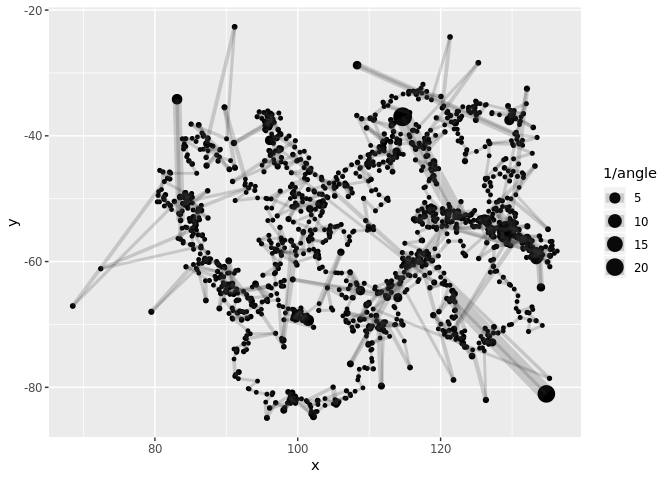
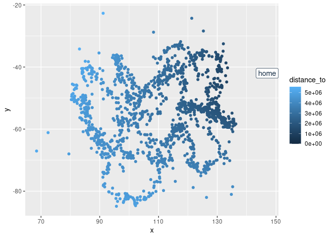
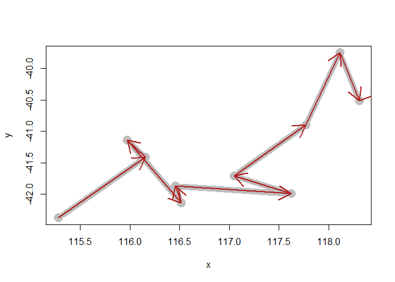
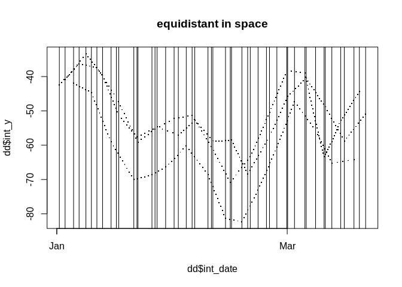
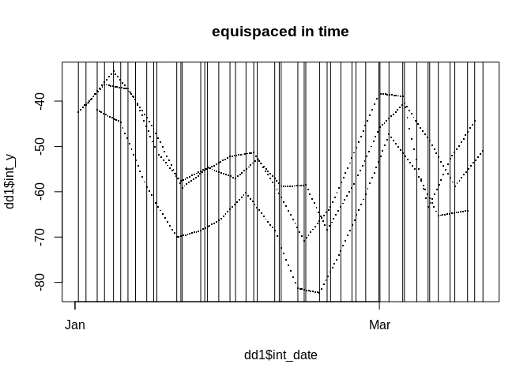

<!-- README.md is generated from README.Rmd. Please edit that file -->

# traipse

<!-- badges: start -->

[](https://cran.r-project.org/package=traipse)
[](https://cran.r-project.org/package=traipse)
[](https://github.com/AustralianAntarcticDivision/traipse/actions/workflows/R-CMD-check.yaml)
<!-- badges: end -->

The goal of traipse is to provide shared tools for tracking data, for
common metrics of distance, direction, and speed. The package includes
the following functions which are always assumed to operate on input
locations in longitude latitude, and input date-times in R’s `POSIXt`
class.

- `track_distance()` for distance in metres
- `track_angle()` for internal angle in degrees
- `track_turn()` for relative turn angle
- `track_bearing()` for absolute bearing
- `track_time()` for duration in seconds
- `track_speed()` for speed in metres per second
- `track_distance_to()` for distance to location
- `track_bearing_to()` for bearing to location
- `track_intermediate()` for interpolating locations
- `track_query()` also for interpolation, by finding locations within a
  given track arbitrarily (in-development)
- `track_grid` for identifying locations in grid cells

Distances are always returned in **metres**, directions and angles are
always returned in **degrees**. Absolute bearing is relative to North
(0), and proceeds clockwise positive and anti-clockwise negative
`N = 0, E = 90, S = +/-180, W = -90`.

Time is always returned in **seconds**, and speed in **metres per
second**.

## No complex data structures

Traipse works directly on longitude and latitude vectors as it is
intended for use within other tools that work directly with data.

There is no capacity for providing nested data structures because this
is trivially done by using tidyverse code like

``` r
data %>% group_by(id) %>% mutate(distance = track_distance(lon, lat)) %>% ungroup()
```

or by arranging use of the functions in various ways. Track metric
values are inherently
[window-like](https://dplyr.tidyverse.org/articles/window-functions.html)
and in traipse padding value/s of `NA` are used to return an element for
every input location.

## Installation

You can install traipse from
[CRAN](https://CRAN.r-project.org/package=traipse) with:

``` r
install.packages("traipse")
```

You can install the development version from
[GitHub](https://github.com/) with:

``` r
# install.packages("devtools")
devtools::install_github("AustralianAntarcticDivision/traipse")
```

## Example

This is a basic example which shows you how to calculate ellipsoidal
distance and turning angle for a data set of tracks.

First, calculate without any groupings - we definitely don’t want this
for real work as there are three separate tracks within our data set
identified by `id`. (No ordering is applied other than the order the
rows occur).

``` r
library(traipse)

library(dplyr)
## there's no grouping here - we haven't gotten our data organized yet
trips0 %>% mutate(distance = track_distance(x, y), angle = track_angle(x, y))
#> # A tibble: 1,500 × 6
#>         x       y date                id    distance    angle
#>     <dbl>   <dbl> <dttm>              <chr>    <dbl>    <dbl>
#>  1 115.28 -42.376 2001-01-01 15:39:50 1          NA   NA     
#>  2 116.15 -41.412 2001-01-01 18:16:52 1      129435. 119.59  
#>  3 115.97 -41.133 2001-01-01 21:03:38 1       34632.   4.4286
#>  4 116.51 -42.139 2001-01-01 22:09:41 1      120575.  13.088 
#>  5 116.46 -41.867 2001-01-01 23:33:54 1       30560.  72.387 
#>  6 117.62 -41.990 2001-01-02 01:25:12 1       97593.  25.596 
#>  7 117.05 -41.707 2001-01-02 06:45:40 1       57005.  89.522 
#>  8 117.77 -40.894 2001-01-02 10:01:26 1      108811. 159.23  
#>  9 118.11 -39.747 2001-01-02 13:49:59 1      130588.  23.769 
#> 10 118.31 -40.508 2001-01-02 16:24:46 1       86066.  64.299 
#> # ℹ 1,490 more rows
```

Now run a set of available metrics, but do it with respect to the
grouping variable `id`.

``` r
metric <- trips0 %>% group_by(id) %>% mutate(distance = track_distance(x, y), 
                                             angle = track_angle(x, y),
                                             turn = track_turn(x, y), 
                                             bearing = track_bearing(x, y), 
                                             duration = track_time(date),
                                             speed = track_speed(x, y, date), 
                                             distance_to = track_distance_to(x, y, 147, -42), 
                                             bearing_to = track_bearing_to(x, y, 100, -42)) 
metric 
#> # A tibble: 1,500 × 12
#> # Groups:   id [3]
#>         x       y date                id    distance    angle     turn  bearing
#>     <dbl>   <dbl> <dttm>              <chr>    <dbl>    <dbl>    <dbl>    <dbl>
#>  1 115.28 -42.376 2001-01-01 15:39:50 1          NA   NA        NA      34.521 
#>  2 116.15 -41.412 2001-01-01 18:16:52 1      129435. 119.59    -60.996 -26.475 
#>  3 115.97 -41.133 2001-01-01 21:03:38 1       34632.   4.4286 -175.45  158.07  
#>  4 116.51 -42.139 2001-01-01 22:09:41 1      120575.  13.088  -167.27   -9.1990
#>  5 116.46 -41.867 2001-01-01 23:33:54 1       30560.  72.387   107.65   98.454 
#>  6 117.62 -41.990 2001-01-02 01:25:12 1       97593.  25.596  -155.18  -56.729 
#>  7 117.05 -41.707 2001-01-02 06:45:40 1       57005.  89.522    90.860  34.131 
#>  8 117.77 -40.894 2001-01-02 10:01:26 1      108811. 159.23    -21.246  12.884 
#>  9 118.11 -39.747 2001-01-02 13:49:59 1      130588.  23.769   156.01  168.90  
#> 10 118.31 -40.508 2001-01-02 16:24:46 1       86066.  64.299  -115.83   53.069 
#> # ℹ 1,490 more rows
#> # ℹ 4 more variables: duration <dbl>, speed <dbl>, distance_to <dbl>,
#> #   bearing_to <dbl>

metric %>% 
  ggplot(aes(x, y, cex= 1/angle)) + 
  geom_point() + 
  geom_path(col = rgb(0.2, 0.2, 0.2, 0.2))
#> Warning: Using `size` aesthetic for lines was deprecated in ggplot2 3.4.0.
#> ℹ Please use `linewidth` instead.
#> This warning is displayed once per session.
#> Call `lifecycle::last_lifecycle_warnings()` to see where this warning was
#> generated.
#> Warning: Removed 6 rows containing missing values or values outside the scale range
#> (`geom_point()`).
#> Warning: Removed 2 rows containing missing values or values outside the scale range
#> (`geom_path()`).
```



``` r

metric %>% 
  ggplot(aes(x, y, colour = distance_to)) + 
  geom_point() + geom_label(data = data.frame(x = 147, y = -42, distance_to = 0), 
                            label = "home")
```



``` r

metric %>% 
  ggplot(aes(x, y, colour = bearing_to)) + 
  geom_point() + geom_label(data = data.frame(x = 100, y = -42, bearing_to = 0), 
                            label = "home")
```


Using the bearing and distance now reproduce the track as *destination
point* segments.

``` r
plot(metric[1:10, c("x", "y")], type = "b", lwd = 10, col = "grey")
dest <- geographiclib::geodesic_direct(
  metric[1:10, c("x", "y")],
  azi = metric$bearing[1:10], s= metric$distance[2:11]
)

arrows(metric$x[1:10], metric$y[1:10], dest$lon2[1:10], dest$lat2[1:10], col = "firebrick", lwd = 2)
```



## Intermediate points require extra handling

The function `track_intermediate()` requires extra work as it inherently
returns multiple variables (lon, lat, date-time). The output is a
list-column of data frames, and if used within
`mutate(inter = track_intermediate(lon, lat, date))` then it will be
stored along side the rows of the input data.

To use this we must unnest the data and treat the new columns as the
output.

See this example.

``` r
if (requireNamespace("tidyr") && requireNamespace("dplyr")) {
tr1 <- trips0[seq(1, nrow(trips0), by = 30), ]
  dd <- tr1 %>% group_by(id) %>%
    mutate(inter = track_intermediate(x, y, date = date, distance = 150000)) %>%
    tidyr::unnest()
  plot(dd$int_date, dd$int_y, pch = ".", cex = 2, main = "equidistant in space")
  abline(v = tr1$date)

  dd1 <- tr1 %>% group_by(id) %>%
    mutate(inter = track_intermediate(x, y, date = date, duration = 3600 * 12)) %>%
    tidyr::unnest()
  plot(dd1$int_date, dd1$int_y, pch = ".", cex = 2, main = "equispaced in time")
  abline(v = tr1$date)
}
#> Warning: `cols` is now required when using `unnest()`.
#> ℹ Please use `cols = c(inter)`.
```



    #> Warning: `cols` is now required when using `unnest()`.
    #> ℹ Please use `cols = c(inter)`.



Query.

``` r
track_query(trips0$x[1:10], trips0$y[1:10], query = c(4.5, 5.5, 6.5))
#> Warning in track_query(trips0$x[1:10], trips0$y[1:10], query = c(4.5, 5.5, :
#> date is null, so assuming linear relative movement in time
#> # A tibble: 3 × 3
#>        x       y  date
#>    <dbl>   <dbl> <dbl>
#> 1 116.49 -42.003   4.5
#> 2 117.04 -41.929   5.5
#> 3 117.33 -41.849   6.5
track_query(trips0$x[1:10], trips0$y[1:10], trips0$date[1:10], query = trips0$date[1:10] + 10)
#> # A tibble: 10 × 3
#>         x       y date               
#>     <dbl>   <dbl> <dttm>             
#>  1 115.28 -42.375 2001-01-01 15:40:00
#>  2 116.15 -41.412 2001-01-01 18:17:02
#>  3 115.97 -41.136 2001-01-01 21:03:48
#>  4 116.51 -42.138 2001-01-01 22:09:51
#>  5 116.46 -41.867 2001-01-01 23:34:04
#>  6 117.62 -41.990 2001-01-02 01:25:22
#>  7 117.05 -41.707 2001-01-02 06:45:50
#>  8 117.77 -40.893 2001-01-02 10:01:36
#>  9 118.11 -39.748 2001-01-02 13:50:09
#> 10  NA     NA     2001-01-02 16:24:56
s <- seq(min(trips0$date), max(trips0$date), by = "1 hour")
trips0 %>% group_by(id) %>% group_modify(~track_query(.x$x, .x$y, .x$date, query = s))
#> # A tibble: 5,751 × 4
#> # Groups:   id [3]
#>    id         x       y date               
#>    <chr>  <dbl>   <dbl> <dttm>             
#>  1 1      NA     NA     2001-01-01 15:24:58
#>  2 1     115.53 -42.099 2001-01-01 16:24:58
#>  3 1     115.86 -41.731 2001-01-01 17:24:58
#>  4 1     116.15 -41.399 2001-01-01 18:24:58
#>  5 1     116.08 -41.298 2001-01-01 19:24:58
#>  6 1     116.01 -41.198 2001-01-01 20:24:58
#>  7 1     116.15 -41.458 2001-01-01 21:24:58
#>  8 1     116.50 -42.090 2001-01-01 22:24:58
#>  9 1     116.46 -41.896 2001-01-01 23:24:58
#> 10 1     116.99 -41.924 2001-01-02 00:24:58
#> # ℹ 5,741 more rows
```

## Data are assumed to be sensibly organized

Note above that we provided a *grouping ID* for when we have separate
trips within the same data set. There’s nothing to stop from calculating
distances when the arrangement of records does not make sense, but this
is your responsibility. If missing values are present, or times are out
of order, or include zero-length time durations, or movement backward in
time there aren’t any checks for that made in the traipse package.

The idea is for developers to be able to use these tools however they
like but with an assumed consistent workflow.

We would like to have a simple core package to provide the most commonly
used metrics. We assume `geodist` and `geosphere` as good examples of
core packages for the underlying tool. These both apply the modern
geodesic methods of C. F. F. Karney (2013) [Algorithms for
geodesics](https://doi.org/10.1007/s00190-012-0578-z)

------------------------------------------------------------------------

Please note that this project is released with a [Contributor Code of
Conduct](https://github.com/AustralianAntarcticDivision/traipse/blob/master/CODE_OF_CONDUCT.md).
By contributing to this project, you agree to abide by its terms.
