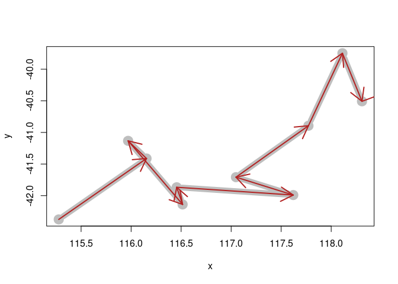

<!-- README.md is generated from README.Rmd. Please edit that file -->

# triplib

NOT YET USEABLE

<!-- badges: start -->

[](https://www.tidyverse.org/lifecycle/#experimental)
[](https://travis-ci.org/Trackage/triplib)
[](https://ci.appveyor.com/project/Trackage/triplib)
[](https://codecov.io/gh/Trackage/triplib?branch=master)
<!-- badges: end -->

The goal of triplib is to provide shared tools for tracking data.

There is a huge fragmentation of tools and approaches in R for tracking,
see the Spatio-Temporal Task View section for examples.

We would like to have a simple core package to provide the most commonly
used metrics. We assume `geodist` and `geosphere` as good examples of
core packages for the underlying tool.

E.g. `amt` is among the best of the best tracking packages, but imports
many monolithic packages as well.

Collect needed functions in this package that are as fast as possible,
and very lightweight, no classes or complications or external libraries.

  - path distance
  - distance to source/target, absolute or cumulative
  - turning angle (direction change)
  - track angle (internal angle of turn)
  - Argos quality codes as ordered factor
  - validation of basic data, and trip sense
  - interpolation based on time step, distance
  - cut for tracks
  - examples and docs\!

## Installation

Not available on CRAN yet.

You can install the development version from
[GitHub](https://github.com/) with:

``` r
# install.packages("devtools")
devtools::install_github("Trackage/triplib")
```

## Example

This is a basic example which shows you how to calculate ellipsoidal
distance and turning angle for a data set of tracks.

First, calculate without any groupings - we definitely don’t want this
as there are three separate tracks within our data set identified by
`id`. (No ordering is a applied other than the order the rows occur).

``` r
library(triplib)

library(tidyverse)
## there's no grouping here - we haven't gotten our data organized yet
trips0 %>% mutate(distance = track_distance(x, y), angle = track_angle(x, y))
#> # A tibble: 1,500 x 6
#>        x     y date                id    distance  angle
#>    <dbl> <dbl> <dttm>              <chr>    <dbl>  <dbl>
#>  1  115. -42.4 2001-01-01 15:39:50 1          NA   NA   
#>  2  116. -41.4 2001-01-01 18:16:52 1      129435. 120.  
#>  3  116. -41.1 2001-01-01 21:03:38 1       34632.   4.43
#>  4  117. -42.1 2001-01-01 22:09:41 1      120575.  13.1 
#>  5  116. -41.9 2001-01-01 23:33:54 1       30560.  72.4 
#>  6  118. -42.0 2001-01-02 01:25:12 1       97593.  25.6 
#>  7  117. -41.7 2001-01-02 06:45:40 1       57005.  89.5 
#>  8  118. -40.9 2001-01-02 10:01:26 1      108811. 159.  
#>  9  118. -39.7 2001-01-02 13:49:59 1      130588.  23.8 
#> 10  118. -40.5 2001-01-02 16:24:46 1       86066.  64.3 
#> # ... with 1,490 more rows
```

Now run the same metrics but do it with respect to the grouping variable
`id`.

TODO: show clearly the nonsense values we get if grouping is not
respected.

``` r
## now we group by id (also need arrange by date to be sure ...)
metric <- trips0 %>% group_by(id) %>% mutate(distance = track_distance(x, y), 
                                             angle = track_angle(x, y),
                                             turn = track_turn(x, y), 
                                             bearing = track_bearing(x, y)) 
metric 
#> # A tibble: 1,500 x 8
#> # Groups:   id [3]
#>        x     y date                id    distance  angle   turn bearing
#>    <dbl> <dbl> <dttm>              <chr>    <dbl>  <dbl>  <dbl>   <dbl>
#>  1  115. -42.4 2001-01-01 15:39:50 1          NA   NA      NA     34.5 
#>  2  116. -41.4 2001-01-01 18:16:52 1      129435. 120.    -61.0  -26.5 
#>  3  116. -41.1 2001-01-01 21:03:38 1       34632.   4.43 -175.   158.  
#>  4  117. -42.1 2001-01-01 22:09:41 1      120575.  13.1  -167.    -9.20
#>  5  116. -41.9 2001-01-01 23:33:54 1       30560.  72.4   108.    98.5 
#>  6  118. -42.0 2001-01-02 01:25:12 1       97593.  25.6  -155.   -56.7 
#>  7  117. -41.7 2001-01-02 06:45:40 1       57005.  89.5    90.9   34.1 
#>  8  118. -40.9 2001-01-02 10:01:26 1      108811. 159.    -21.2   12.9 
#>  9  118. -39.7 2001-01-02 13:49:59 1      130588.  23.8   156.   169.  
#> 10  118. -40.5 2001-01-02 16:24:46 1       86066.  64.3  -116.    53.1 
#> # ... with 1,490 more rows

metric %>% 
  ggplot(aes(x, y, cex= 1/angle)) + 
  geom_point() + 
  geom_path(col = rgb(0.2, 0.2, 0.2, 0.2))
#> Warning: Removed 6 rows containing missing values (geom_point).
#> Warning: Removed 2 rows containing missing values (geom_path).
```


Using the bearing and distance now reproduce the track as *destination
point* segments.

``` r
plot(metric[1:10, c("x", "y")], type = "b", lwd = 10, col = "grey")
dest <- geosphere::destPoint(metric[1:10, c("x", "y")], 
                             b = metric$bearing[1:10], 
                            d = metric$distance[2:11])
arrows(metric$x[1:10], metric$y[1:10], dest[1:10,1], dest[1:10,2], col = "firebrick", lwd = 2)
```



-----

Please note that the ‘triplib’ project is released with a [Contributor
Code of Conduct](CODE_OF_CONDUCT.md). By contributing to this project,
you agree to abide by its terms.
